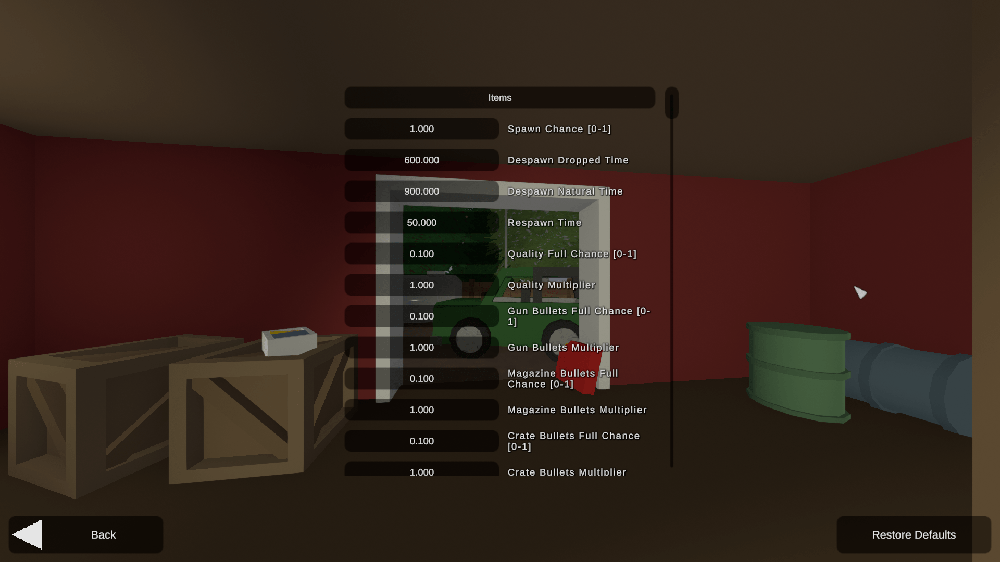

# Config.json
> 📌 **IMPORTANT NOTICE**  
> As of Unturned version **3.25.8.0** the `Config.json` file has been replaced by the new `Config.txt` file. This guide is kept for historical purposes, but we recommend using the **[Config.txt](/servers/docs/unturned-server/config-txt)** file for configuring your Unturned server.


The `Config.json` is the main configuration file for your Unturned server. It contains all the settings that control how your server behaves. 

You can find this file in the same `Servers/Default` or `Servers/unturned` directory as the **[WorkshopDownloadConfig.json](../unturned-server/workshopdownloadconfig-json)** file. 

## Structure
The `Config.json` file is divided into several sections that control different aspects of the server. Here is a typical structure of the `Config.json` file:
```
Config.json
├── Browser
├── Server
├── UnityEvents
├── Easy
│   ├── Items
│   ├── Vehicles
│   ├── Zombies
│   └── ...
├── Normal
│   ├── Items
│   ├── Vehicles
│   ├── Zombies
│   └── ...
└── Hard
    ├── Items
    ├── Vehicles
    ├── Zombies
    └── ...
```

It is important to know what difficulty is your server set to, as it will determine which settings are used. The `Easy`, `Normal`, and `Hard` sections contain the settings for each difficulty level.

By default the server is set to `Normal` unless you change it in the **[Commands.dat](../unturned-server/commands-dat)** file.

## Sections
We have written detailed guides for each section of the `Config.json` file.
- **[Browser](browser)** - Customizes how your server appears in the server browser list.
- **[Server](server)** - Controls core server functionality including security, timeouts, and scheduled events.
- **[UnityEvents](unityevents)** - Manages debug options for certain community mods.
- **[Items](items)** - Adjusts item spawn rates, quality, and durability settings.
- **[Vehicles](vehicles)** - Configures vehicle spawning, condition, and maximum counts.
- **[Zombies](zombies)** - Determines zombie types, behavior, difficulty, and loot drops.
- **[Animals](animals)** - Sets animal spawning, damage, and health parameters.
- **[Barricades](barricades)** - Controls barricade durability, damage resistance, and placement rules.
- **[Structures](structures)** - Manages building decay and damage multipliers.
- **[Players](players)** - Configures player health, hunger, skills, and death penalties.
- **[Objects](objects)** - Adjusts environment item respawn rates and resource drops.
- **[Events](events)** - Controls weather, airdrops, and arena settings.
- **[Gameplay](gameplay)** - Manages UI elements, groups, and general gameplay mechanics.

> **💡 PRO TIP**  
> All `Items` to `Gameplay` sections are the same in the **Advanced** settings in Singleplayer :)  
> 