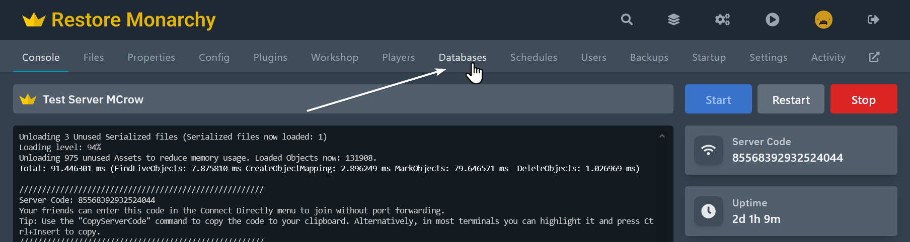
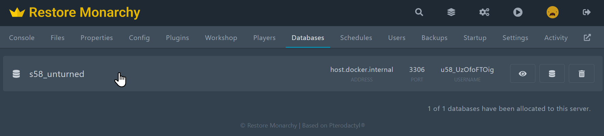
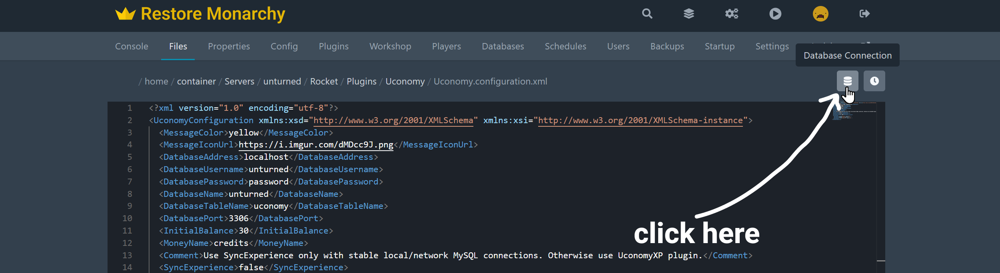
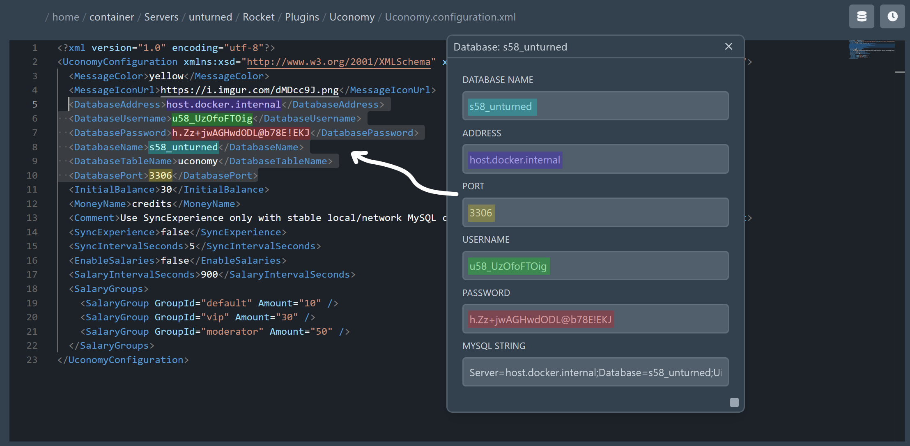
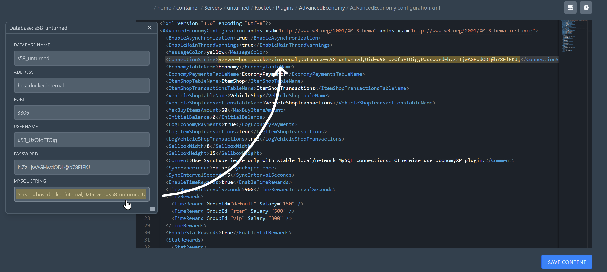
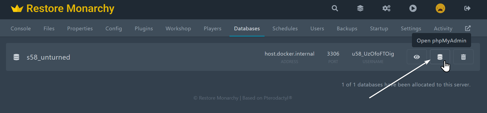
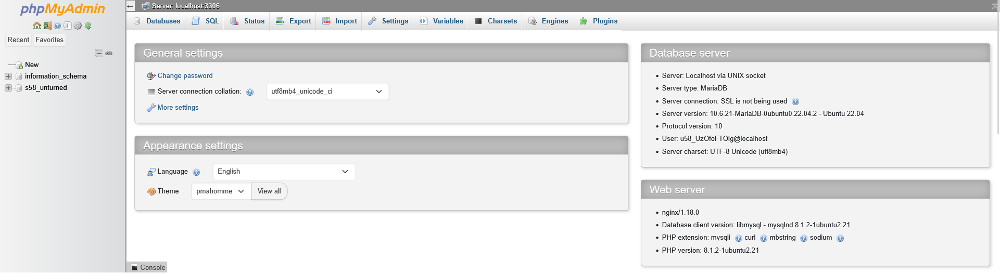

# MySQL Database
This guide only applies to [our hosting](/hosting). If you are using a different hosting provider, please refer to their documentation for setting up a MySQL database.

## Creating a MySQL Database
1. Log in to your [control panel](https://panel.restoremonarchy.com).
2. Go to your server console page and click **Databases** in the menu.



3. Click **New Database** button and it should create a new database for you.



## Configuring a Plugin to Use the MySQL Database
In all plugins that use a MySQL database, you need to set the database connection information in the configuration file. 

Open the configuration file of the plugin that you want to use and look for the database connection settings. The settings may vary depending on the plugin you are using.

While you are in file editor, you can also see the database connection information in by clicking the button with database icon in the top right corner like in the image below. This will show you the database connection information that you can use to connect to the database in your plugin configuration file.



### Database Connection Information

In plugins like [Uconomy](/servers/plugins/uconomy), [UPets](/servers/plugins/upets), [Moderation](/servers/plugins/moderation) etc. you have to set **address, username, password, database name** separately in the configuration file. For example, in Uconomy, you have to set the following values in the `Uconomy.configuration.xml` file:
```xml
<DatabaseAddress>localhost</DatabaseAddress>
<DatabaseUsername>unturned</DatabaseUsername>
<DatabasePassword>password</DatabasePassword>
<DatabaseName>unturned</DatabaseName>
<DatabaseTableName>uconomy</DatabaseTableName>
<DatabasePort>3306</DatabasePort>
```

You can find the values for these settings in the database connection information that you opened in the file editor. The values are as follows:
- **Database Address**: This is the address of the database server. For our hosting, it is always `host.docker.internal`.
- **Database Username**: This is the username of the database user.
- **Database Password**: This is the password of the database user.
- **Database Name**: This is the name of the database you created in the previous step.
- **Database Table Name**: This is the name of the table that the plugin will use to store data. You can set this to whatever you want, but it is recommended to not change it from the default value.



### Connection String

In plugins like [Advanced Economy](/servers/plugins/advancedeconomy), [MySQL Vault](/servers/plugins/mysqlvault), [Battlepass](/servers/plugins/battlepass) etc. you only need to set the connection string which contains all the information needed to connect to the database. For example, in Advanced Economy, you have to set the following value in the `AdvancedEconomy.configuration.xml` file:
```xml
<ConnectionString>Server=127.0.0.1;Database=unturned;User Id=root;Password=password;</ConnectionString>
```




## Connecting to the Database
If you need to view some data from the database or change some data manually, you can connect to your server's database.

For security reasons, we do not allow connection to the database from outside of the server. You can only connect it through plugins that are running on the server or PHPMyAdmin. 

To connect to the database using PHPMyAdmin that allows you to access data and run queries, follow these steps:

1. Go to your server **Databases** page and click the 2nd button on the right of the database you want to connect to. This will open PHPMyAdmin in a new tab.


2. Once you are in PHPMyAdmin, you can manage your database. If you have already connected some plugins to the database, you can see the tables created by them by expanding the database on the left side of the screen. You can also run SQL queries by clicking on the **SQL** tab at the top of the page.


