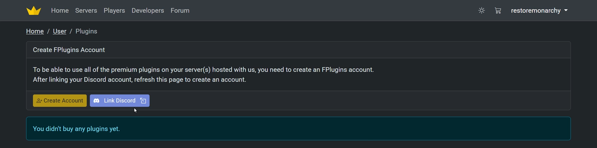
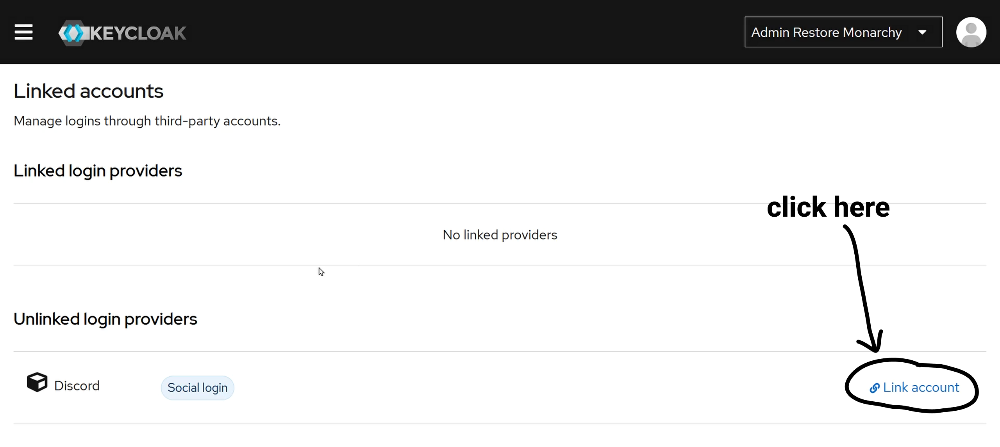
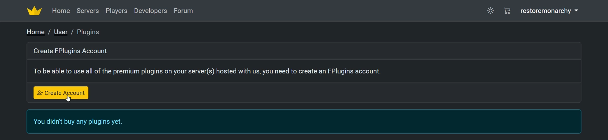
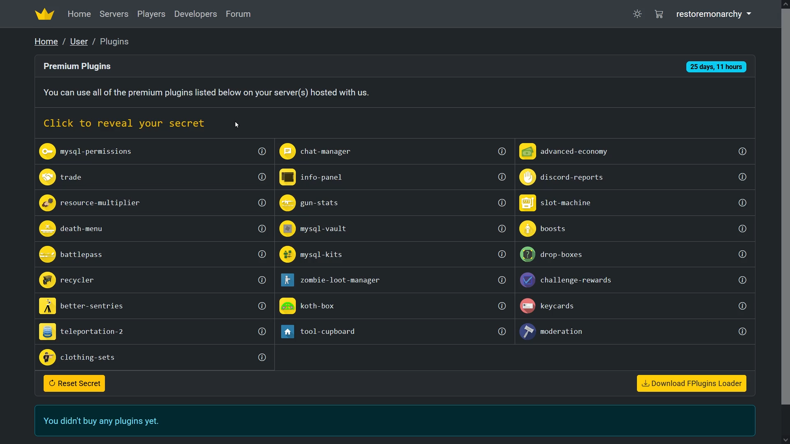
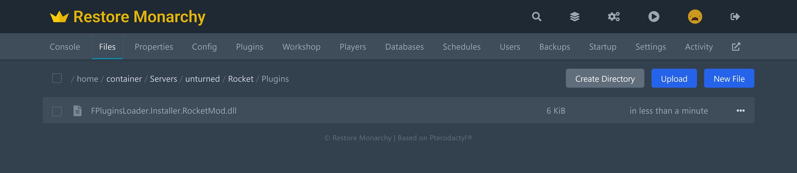
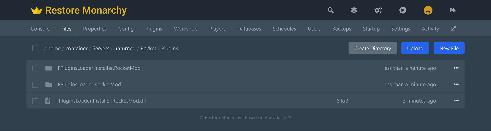
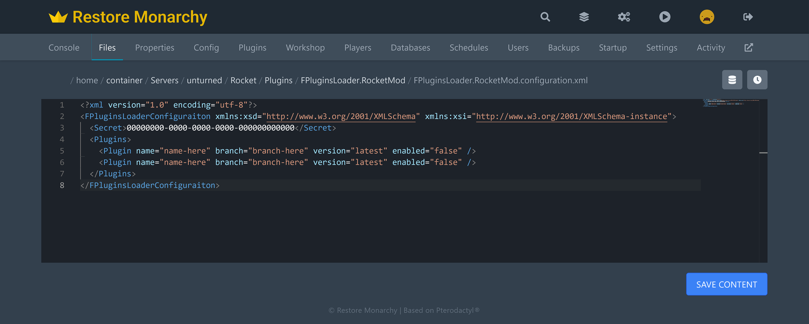
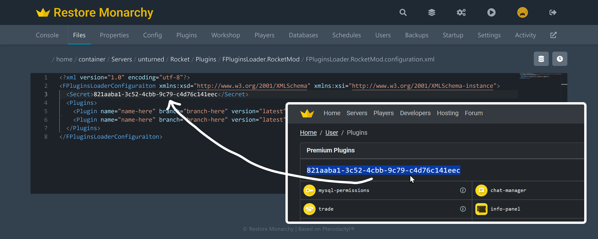
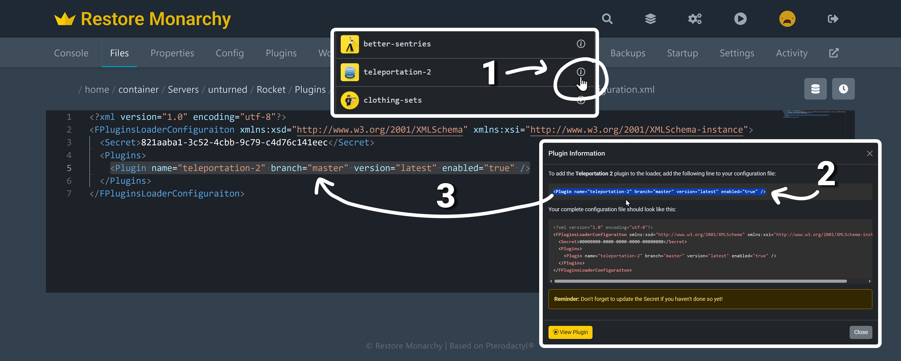

# Premium Plugins
If you are using our hosting, you can use our premium plugins on your Unturned server. This guide will help you set up and use these plugins.

## How to use our premium plugins
To use our premium plugins, you need to use the **FPlugins Loader**. Below are the steps to set it up:

1. Log in to your account and go to the **[User Plugins](https://restoremonarchy.com/user/plugins)** page.
2. There if you have purchased a server, you will see a button to create an account on FPlugins.  
Before you can use it, you need to link your account with Discord, because FPlugins requires it. You might have already have it linked, if you registered on our website using Discord. If you have not done so, you should see a button to link your Discord account.

> After pressing the "Link Discord" button, you will be redirected to the account management page where you need to click "Link account" and then authorize Restore Monarchy to access your Discord account username, avatar and email. This is necessary to create an account on FPlugins.
> 

3. After linking your Discord account, go back to the **[User Plugins](https://restoremonarchy.com/user/plugins)** page, refresh the page if you still see the **Link Discord** button, and press the **Create Account** button to create an account on FPlugins.

4. The page will refresh and you will see the list of plugins, your FPlugins secret and the **Download FPlugins Loader** button. 

5. Download the **FPlugins Loader** and install it like any other Unturned plugin on your server.

6. Restart the server and when the server is up, the **FPluginsLoader.RocketMod** folder will be created in the same **Plugins** folder where you installed the loader.

7. Open the **FPluginsLoader.RocketMod** folder and then open the **FPluginsLoader.RocketMod.configuration.xml** file.  

8. In the **FPluginsLoader.RocketMod.configuration.xml** file, you need to set the **Secret** to the secret you see on the **[User Plugins](https://restoremonarchy.com/user/plugins)** page.

9. Finally, in the `<Plugins>` section, you can add the plugins you want to use. The list of plugins is avaiable on the same **[User Plugins](https://restoremonarchy.com/user/plugins)** page. When you click on the info icon next to the plugin name, it will open a dialog with the line to copy and paste in the `<Plugins>` section.

10. Save the **FPluginsLoader.RocketMod.configuration.xml** file and restart the server. The plugins will be downloaded and installed automatically.

## Video Tutorial
We have a video tutorial that shows you how to set up and use our premium plugins on your Unturned server. You can watch it below:
[video=dbc054a5-210e-4e76-a425-dd7bc2d87900]