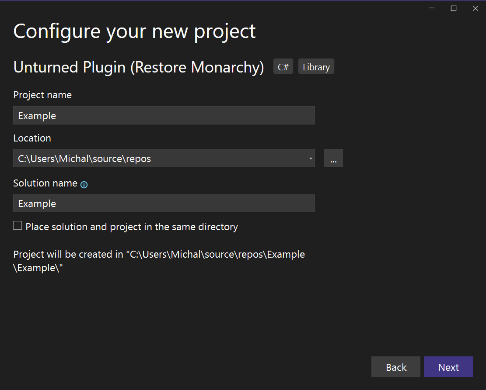
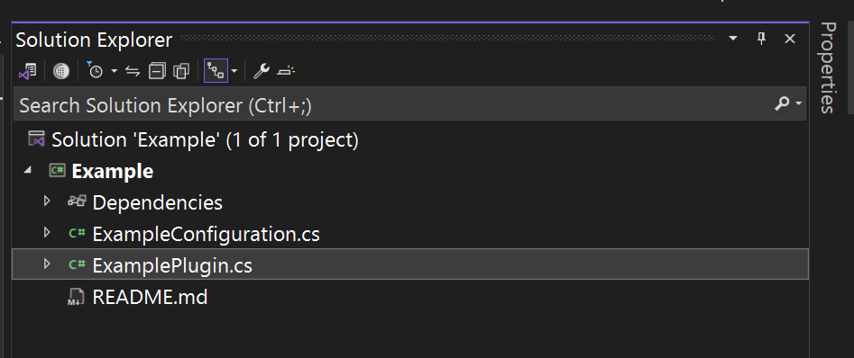
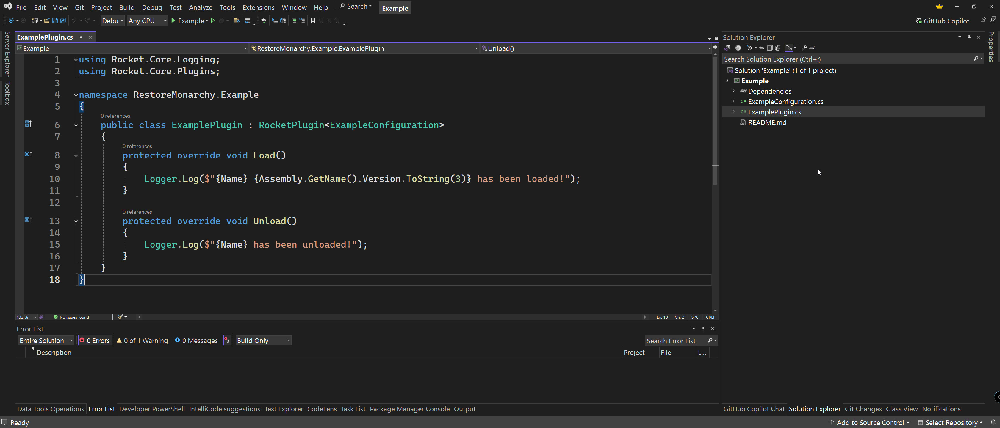
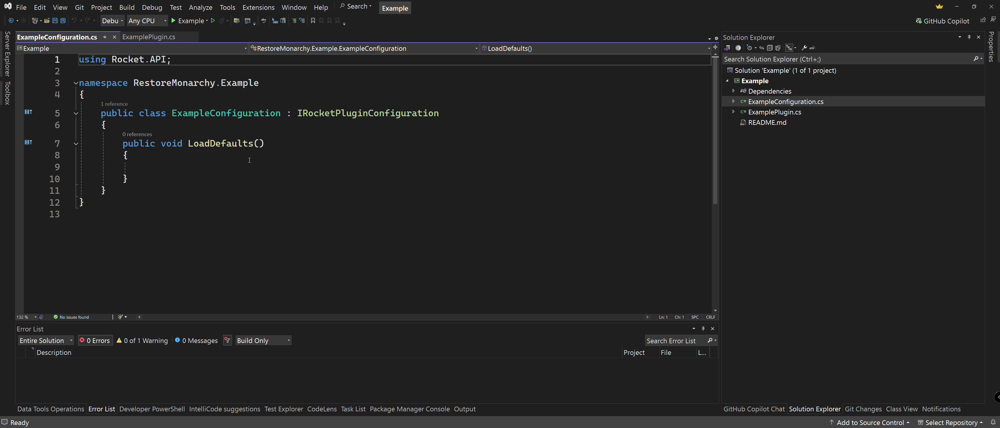
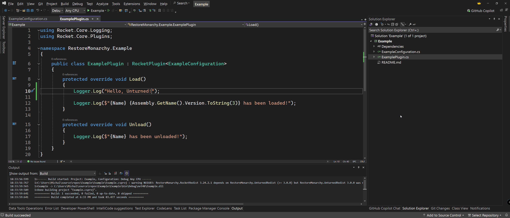
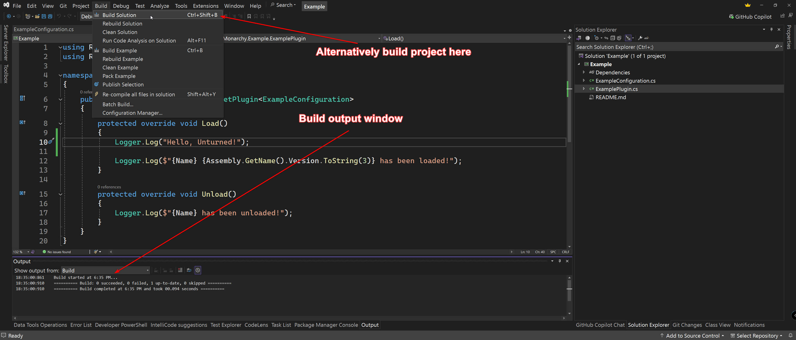
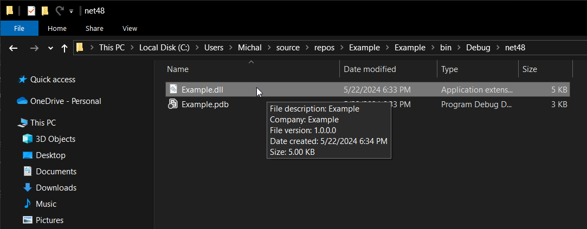
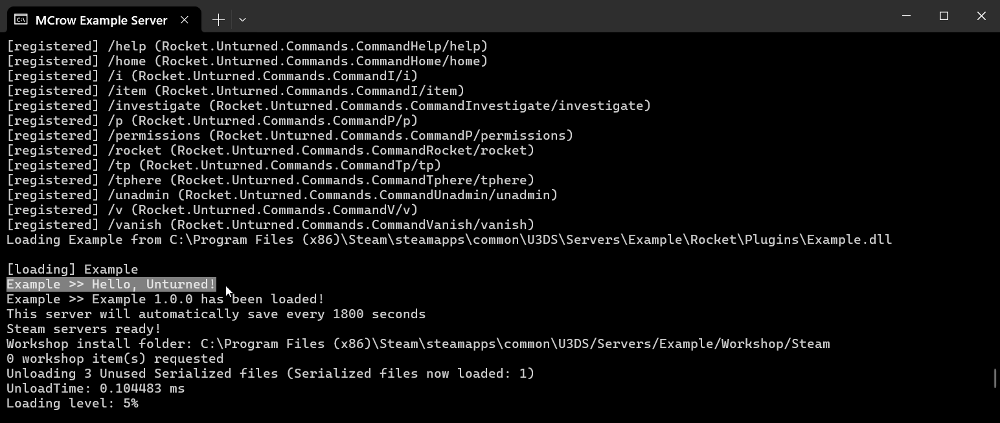

# Creating a Project
In this guide, we will create a new Unturned plugin project using the Unturned Plugin project template. We will add a log message to the plugin and test it on an Unturned server.

## Prerequisites
Before you start, make sure you have the installed Visual Studio and Unturned project templates. If you haven't installed them yet, follow the [Development Environment](development-environment) guide.


## Create a new project
Open Visual Studio and press on `Create a new project`. Search for `Unturned` and select `Unturned Plugin`.  

Enter the name of the project, for example, `Kits`, `ChatManager` or `AdminTools`. For the purpose of this guide we will name our project `Example`.

Naming rules to follow:
   * Try to use a single or two-word name that describes the functionality of the plugin.
   * The name should be unique and not conflict with existing plugins.
   * If you can't find a unique name, you can add a prefix which can be your name, server name or signature, for example `AviKits`, `ZaupShop` and `RFVault`.

You can leave project location and solution name as default. Don't check the `Place solution and project in the same directory` checkbox. Press `Create`.  



In the next window as Author enter your name or nickname. It is required and can't contain spaces, because it is used in the project namespace. It helps to identify the author of plugin in error logs. Press `Create`.

## Plugin structure
In the Solution Explorer, you will see the project structure. Open `ExamplePlpugin.cs` and `ExampleConfiguration.cs` files in the `Example` project.  



`ExamplePlugin.cs` file contains the main class of the plugin. It is derived from `RocketPlugin` class and contains the `Load` and `Unload` methods. These methods are called when the plugin is loaded and unloaded.



The other file you will see is `ExampleConfiguration.cs`. This file contains the configuration of the plugin. We will use it in the next guides to store plugin settings.



## Add a log message
In the `Load` method of the `ExamplePlugin` class, add the following line of code:
```cs
Logger.Log("Hello, Unturned!");
```
The `Logger` class is a static class that is used to log messages to the console and Rocket.log file. It is part of the RocketMod library.



## Compile the plugin
Press `Ctrl + Shift + B` to compile the plugin. If there are no errors, you will see `Build succeeded` in the output window.  
Alternatively you can press `Build` -> `Build Solution` in the menu.



## Install the plugin
Right click on the `Example` project and press `Open Folder in File Explorer`. Navigate to `bin` -> `Debug` -> `net48` folder. Copy the `Example.dll` file to the `Rocket` -> `Plugins` folder on your Unturned server. 



## Test the plugin
Start your Unturned server. In the console, you should see the message `Hello, Unturned!`. This means the plugin was loaded successfully.



## Conclusion
Congratulations! You have created your first Unturned plugin. In the next guide, we will learn how to handle events and commands in the plugin.
