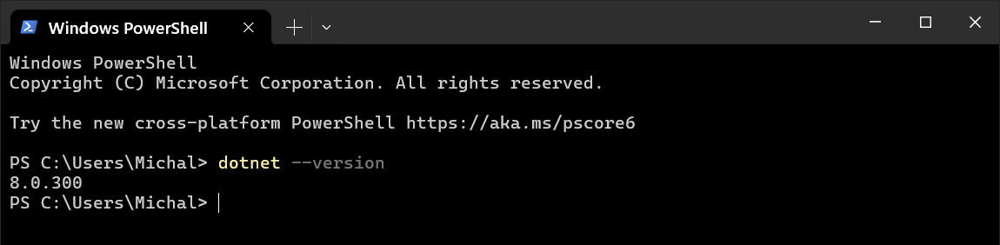
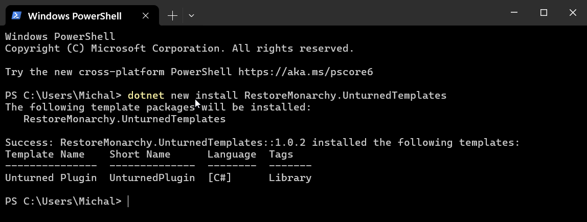
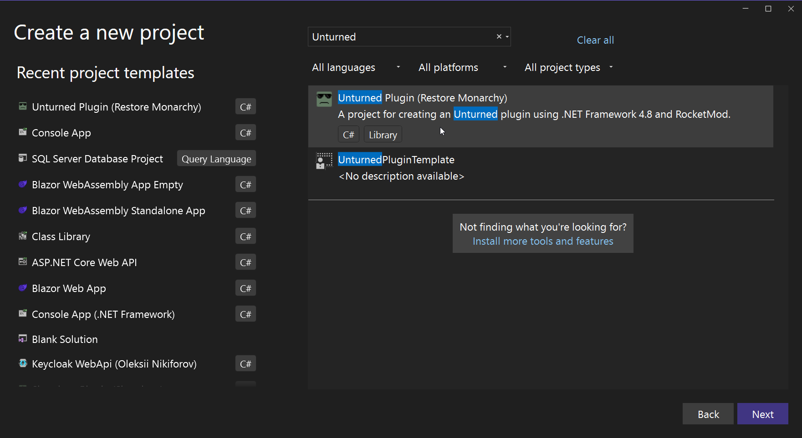

# Development Environment
Setting up your development environment is the first step to creating plugins for Unturned. This guide will help you set up Visual Studio and install project templates for creating plugins.

## Visual Studio


**Visual Studio** is an integrated development environment (IDE) from Microsoft that is used for developing applications in C# and other languages. It is the recommended IDE for developing Unturned plugins.

### Install Visual Studio
1. Go to [visualstudio.microsoft.com](https://visualstudio.microsoft.com/) and download the latest version of Visual Studio.
2. Run the installer and follow the instructions. 
3. Select the **Visual Studio Community** edition, which is free for individual developers.
4. Then, select the **.NET desktop development** workload.
5. Open Visual Studio to verify the installation.

## Unturned Templates
We have created a custom project template for creating Unturned plugins. This template will help you get started with plugin development quickly and let you more easily create new plugins in the future.

Before you can install the templates, you need to install the .NET SDK. The .NET SDK contains the .NET CLI, which is required to install custom project templates for Visual Studio.

### Install .NET SDK
1. Go to [dotnet.microsoft.com](https://dotnet.microsoft.com/download) and download the latest .NET SDK.
2. Run the installer and follow the instructions.
3. Open a terminal or PowerShell window and run `dotnet --version` to verify the installation. You should see the version of the SDK you installed.

   

Now that you have the .NET SDK installed, you can install the Unturned project templates.

### Install Unturned Templates

1. Close Visual Studio if it is open.
2. Open a terminal or PowerShell window and run the following command:
   ```shell
   dotnet new -i RestoreMonarchy.UnturnedTemplates
   ```
   You should see output similar to the following:

   
3. Open Visual Studio and click on `Create a new project`.
4. Search for `Unturned`. You should see the list of Unturned templates.

   


### Conclusion
You have now set up your development environment for creating Unturned plugins. In the next guide, we will create a new plugin using the **Unturned Plugin** project template we installed.