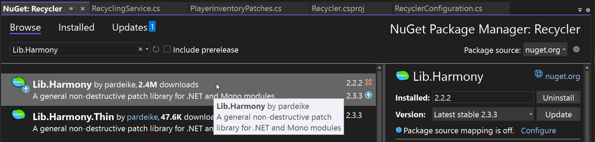
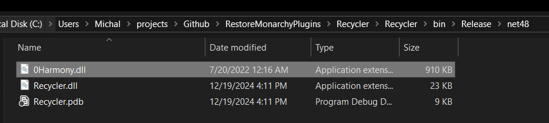

# Harmony Patching
Harmony patching in Unturned plugins is mostly used to modify the game's code or add hooks to methods for which events are not available. 

[Harmony](https://github.com/pardeike/Harmony) is a library that allows you to patch methods in assemblies at runtime. It's used in many plugins to modify the game's behavior without changing the game's code directly.

In this guide, we will show the basic usage of using Harmony in Unturned plugins.

## Requirements
Harmony is a .NET library, so you first need to add it to your project. You can do this by installing the `Lib.Harmony` NuGet package.



> **💡 PRO TIP**  
> Remember to copy `0Harmony.dll` to `Rocket/Libraries` of your server and to always share it with your plugin.  
> After building the project, the `0Harmony.dll` will be in the same `bin/Debug` or `bin/Release` directory as your plugin dll.
> 
> 

## Applying Patches
To apply patches that are in your plugin, you need to create a Harmony instance with a unique ID. This ID is used to identify your patches and avoid conflicts with other plugins.

I suggest the following format for the ID: `com.brand_name.plugin_name`. For example, `com.restoremonarchy.upets` or `com.sunnamed.bettervanish`.

Below is an example of how to apply patches in your plugin:
```cs
using Rocket.Core.Plugins;
using HarmonyLib;

public class UPets : RocketPlugin
{
    public const string HarmonyId = "com.restoremonarchy.upets";
    private Harmony harmony;

    protected override void Load()
    {
        harmony = new Harmony(HarmonyId);
        harmony.PatchAll(); // Applies all patches in your plugin.
    }

    protected override void Unload()
    {
        if (harmony != null)
        {
            harmony.UnpatchAll(HarmonyId);
        }
    }
}
```

## Where to Find Methods to Patch?
If you don't know yet what method you want to patch, you can look for it in Unturned code. The easiest way is by using de-compilers like dnSpy or DotPeek by JetBrains. You can learn more about this method in our blog post [Finding Events](/developers/blog/unt07-finding-events).

## Creating Patches
There are many methods of using Harmony to patch methods. For the complete list, see the [Harmony documentation](https://harmony.pardeike.net/articles/patching.html). 

Here I will show you my favorite way of patching methods using Harmony. We will create a patch that will prevent animals from attacking players.

First create a new folder in your project and call it **Patches**. Inside this folder, create a new class and name it `AnimalManagerPatches` where **AnimalManager** is the class we want to patch.
```cs
using HarmonyLib;
using SDG.Unturned;

namespace RestoreMonarchy.UPets.Patches
{
    [HarmonyPatch(typeof(AnimalManager))] // Specify the target class.
    class AnimalManagerPatches
    {
        [HarmonyPatch("sendAnimalAttack")] // Specify the target method.
        [HarmonyPrefix] // The patch type. Prefix runs before the original method.
        static bool PrefixAttack(Animal animal) // You can use arguments from the original method
        {
            return false; // Return false to skip the original method.
        }
    }
}
```

In the example above, we created a patch that will run before the `sendAnimalAttack` method in the `AnimalManager` class. We return `false` to skip the original method. This way, animals like wolves and bears will not attack players.

> **💡 PRO TIP**  
> Patch methods must be static but they can be public or private.  
> You can also use `void` as the return type if you don't need to skip the original method.

## Conclusion
This is only a simple example and one way that you can use Harmony in your plugins. There are many other ways to use Harmony, and you can find more information in the [Harmony documentation](https://harmony.pardeike.net/articles/intro.html).