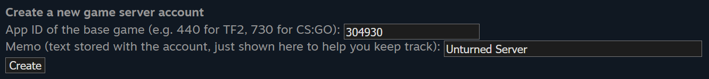
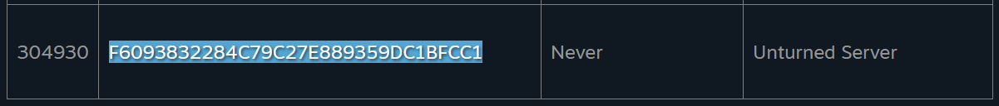
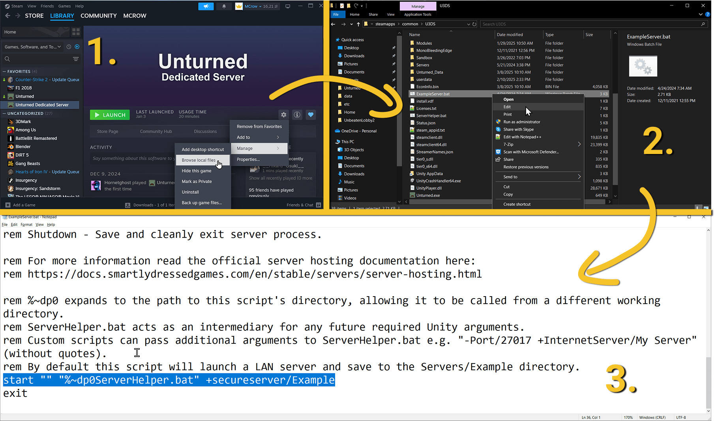

# Making Your Unturned Server Public
In this guide, you'll learn how to make your Unturned server public. 

If you host a server on a Game Server Hosting provider, like [our hosting](/hosting), you only need to create a [Game Server Login Token (GSLT)](#game-server-login-token-gslt).

If you host the server on your computer, you need to follow two additional steps to make your server public: [Startup Command](#startup-command) and [Fake IP](#fake-ip).

## Game Server Login Token (GSLT)
To make your server public, you need to create a Game Server Login Token (GSLT) on Steam. This token is linked to your Steam account and allows your server to be listed on the public server list.

1. Go to [steamcommunity.com/dev/managegameservers](https://steamcommunity.com/dev/managegameservers) and log in with your Steam account. 
2. Scroll down to the bottom and you will see the **Create a new game server account** form.
3. Fill in the form with the following details:
   - **App ID**: `304930` (Unturned's App ID)
   - **Memo**: A name for your server (e.g., My Unturned Server)
   - **Click the "Create" button**
   
    

4. This will create a new GSLT for your server. Copy it.  

    

5. Go to your server files and open the **Config.json** file. Find and set the `Login_Token` field to the GSLT you copied.
```json
"Browser": {
    "Icon": "",
    "Thumbnail": "",
    "Desc_Hint": "",
    "Desc_Full": "",
    "Desc_Server_List": "",
    "Login_Token": "F6093832284C79C27E889359DC1BFCC1",
    "BookmarkHost": "",
    "Monetization": "Unspecified",
    "Links": null
},
```

### Video
Watch this video to learn how to create a GSLT for your Unturned server.
**[How to Make Unturned Server Public](https://www.youtube.com/watch?v=ck--2zWlrlw)**
[video=7d19e2f9-4b35-4193-85f4-cd94c7915c03]

## Startup Command
**If you are hosting the server on your computer**, you will need to run it using the `ExampleServer.bat` file instead of directly running the server executeable or through Steam.

1. In Steam Library, right-click on **Unturned Dedicated Server**, hover over **Manage**, and click **Browse Local Files**.
2. Find the **ExampleServer.bat** file and run it. From now on, use this file to start your server.

> **💡 PRO TIP**  
> The `Example` in the command is the name of the folder where your server files are located in the **Servers** directory. If you have already set up your server, replace `Example` with the name of your server folder, for example, `Default`.  
> Alternatively you can just rename the `Servers/Default` folder to `Servers/Example` and use the `ExampleServer.bat` file as is.  
> 


## Fake IP
**If you are hosting the server on your computer**, instead of port forwarding, you can just use a Fake IP feature to make your server public and show up in the server list. This is actually an easier and better option for security reasons as it hides your real IP address.

1. Go to your server files and open the **Config.json** file.
2. At the bottom of the `Server` section, you will find `Use_FakeIP` option. Set it to `true`.

```json
    "Update_Shutdown_Warnings": [
    "00:03:00",
    "00:01:00",
    "00:00:30",
    "00:00:15",
    "00:00:03",
    "00:00:02",
    "00:00:01"
    ],
    "Validate_EconInfo_Hash": true,
    "Use_FakeIP": true
},
```