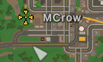

# Vanilla Commands
This the list of vanilla player commands on the server that can be used in-game as an admin. 

## Table of Contents
- [Non-Cheats Commands](#non-cheats-commands)
    - [Admin](#admin)
    - [Unadmin](#unadmin)
    - [Ban](#ban)
    - [Unban](#unban)
    - [Kick](#kick)
    - [Spy](#spy)
    - [Day](#day)
    - [Night](#night)
    - [Weather](#weather)
    - [Time](#time)
    - [Airdrop](#airdrop)
    - [Say](#say)
    - [Teleport](#teleport)
    - [Video Tutorial](#video-tutorial)
- [Cheats Commands](#cheats-commands)
    - [Give](#give)
    - [Vehicle](#vehicle)
    - [Experience](#experience)
    - [Animal](#animal)
    - [Video Tutorial](#video-tutorial)

## Non-Cheats Commands
This is a list of vanilla player commands that can be used in-game on the server as an admin by typing them in the chat.

> **💡 PRO TIP**  
> If you have Rocket or OpenMod installed on your server, instead of using `/` as a separator, you must use ` ` (space) as a separator.  
> That's why when you want to include space in the message or reason, you must use quotes.   
For example: `/say "Welcome to our server!" 255 0 0` instead of `/say Welcome to our server!/255/0/0`.

### Admin
The `admin` command is used to give a player admin blue hammer. Admin can use all commands and has access to all permissions.

**Syntax:** `/admin <player>`
- `<player>`: The name of the player to give admin to.

**Example:** `/admin MCrow`

### Unadmin
The `unadmin` command is used to remove admin blue hammer from a player.

**Syntax:** `/unadmin <player>`
- `<player>`: The name of the player to remove admin from.

**Example:** `/unadmin MCrow`

> **💡 PRO TIP**  
> Unfortunately there is no way to remove admin from someone who is offline. If you want you can delete all admins.  
Stop the server and delete the `Adminlist.dat` file which you will find in the same directory as **[Commands.dat](commands-dat)**

### Ban
The `ban` command is used to ban a player from the server for a specified time.  

**Syntax:** `/ban <player>/[reason]/[time]`
- `<player>`: The name or Steam ID of the player to ban.
- `[reason]`: The reason for the ban.
- `[time]`: The duration of the ban in seconds. If not specified, the ban is permanent.

**Example Vanilla:** `/ban MCrow/Griefing and cross-teaming/3600`  
**Example with Rocket/OpenMod:** `/ban MCrow "Griefing and cross-teaming" 3600`

### Unban
The `unban` command is used to unban a player from the server. 

**Syntax:** `/unban <player>`
- `<player>`: The Steam ID of the player to unban.

**Example:** `/unban 76561198285897058`

> **💡 PRO TIP**  
> If you want to delete all bans from the server, stop the server and delete the `Blacklist.dat` file in the same directory as **[Commands.dat](commands-dat)**.

### Kick
The `kick` command is used to kick a player from the server.

**Syntax:** `/kick <player>/[reason]`
- `<player>`: The name of the player to kick.
- `[reason]`: The reason for the kick.

**Example Vanilla:** `/kick MCrow/Abusive language`  
**Example with Rocket/OpenMod:** `/kick MCrow "Abusive language"`

### Spy
The `spy` command is used to take a screenshot of a player's screen. After using the command, you can view when you press the `ESC` key.

**Syntax:** `/spy <player>`
- `<player>`: The name of the player to spy on.

**Example:** `/spy MCrow`

### Day
The `day` command is used to change the time of the server to day.

**Syntax:** `/day`

### Night
The `night` command is used to change the time of the server to night.

**Syntax:** `/night`

### Weather
The `weather` command is used to change the weather of the server.

**Syntax:** `/weather <weather>`
- `<weather>`: The weather to set. Possible values are `none`, `disable`, `storm`, `blizzard` or you can specify a custom weather asset guid.

**Example:** `/weather storm`, `/weather 6c850687bdb947a689fa8de8a8d99afb`

> **💡 PRO TIP**  
> You can find the weather asset guids in the official [Unturned Wiki](https://unturned.wiki.gg/wiki/Weather).

### Time
The `time` command is used to change the time of the server.

**Syntax:** `/time <time>`
- `<time>`: The time to set in seconds. By default full day in Unturned is 1 hour, so 3,600 seconds.

**Example:** `/time 3200`

### Airdrop
The `airdrop` command is used to call an airdrop.

**Syntax:** `/airdrop`

### Say
The `say` command is used to send a message to all players on the server.

**Syntax:** `/say <message>/[r]/[g]/[b]`

**Example Vanilla:** `/say Welcome to our server!/255/0/0`  
**Example with Rocket/OpenMod:** `/say "Welcome to our server!" 255 0 0`

### Teleport
The `teleport` command is a complex command that can be used in different ways to teleport yourself or other players.

**Syntax:** `/teleport [player]/[location]`
- `[player]`: The name of the player to teleport. If you want to teleport yourself, you can leave this field empty.
- `[location]`: The location to teleport to. It can be one of the following:
    - `player`: Name of the player to teleport to.
    - `bed`: Teleports the player to their bed.
    - `wp`: Teleports you to a waypoint, can only be used to teleport yourself.
    - `node`: Name of the node like city or other location. For example, `Seattle`, `Alberton`, `Airport`.

**Examples Vanilla:** `/teleport MCrow/Seattle`, `/teleport bed`, `/teleport wp`, `/teleport Seattle`  
**Examples with Rocket/OpenMod:** `/teleport MCrow Seattle`, `/teleport bed`, `/teleport wp`, `/teleport Seattle`

> **💡 PRO TIP**  
> When using the `/teleport wp` command, you can set a waypoint by right clicking on the map to set a marker.
>
> 

### Video Tutorial
Check out our video where we show you how to use 10 of these commands in-game.

[video=8b1061f4-72c4-4417-91a8-6f884bfefbb6]

## Cheats Commands
In order to be able to use cheats commands, you need to have enabled cheats in the server **[Commands.dat](commands-dat)** file. You can do this by simply adding the `cheats` to the file.

If you are hosting multiplayer server I don't recommend enabling cheats, because then your server won't be listed in the server browser for players with default filters.  

If you want to use commands to spawn in items and vehicles, I recommend installing Rocket on your server and using the commands `/i` and `/v` instead.

### Give
The `give` command is used to spawn in items.

**Syntax:** `/give [player]/<item>/[amount]`
- `[player]`: The name of the player to give the item to. If not specified, the item is given to the player who executed the command.
- `<item>`: The id of the item to spawn.
- `[amount]`: The 

**Example:** `/give 15/2`, `/give 363`, `/give MCrow/254/5`

> **💡 PRO TIP**  
> When you are specifying the amount of items, you need to use the `/` character to separate the item id and the amount.

### Vehicle
The `vehicle` command is used to spawn in vehicles at your current position.

**Syntax:** `/vehicle <vehicle>`
- `<vehicle>`: The id of the vehicle to spawn.

**Example:** `/vehicle 93`

### Experience
The `experience` command is used to give experience to a player.

**Syntax:** `/experience [player]/<amount>`
- `[player]`: The name of the player to give the experience to. If not specified, the experience is given to the player who executed the command.
- `<amount>`: The amount of experience to give.

**Example:** `/experience 1000`, `/experience MCrow/500`

### Animal
The `animal` command is used to spawn in animals at your current position.

**Syntax:** `/animal <animal>`
- `<animal>`: The id of the animal to spawn.

**Example:** `/animal 3`

### Video Tutorial
Here is a video tutorial on how to use cheats commands in Unturned.

[video=bc9386bf-bd04-419e-a032-a4f456bc1a87]