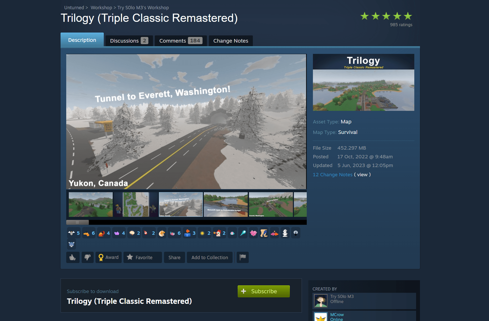

# Installing Workshop Maps on Unturned Server
This guide will walk you through the process of installing and configuring workshop maps on your Unturned server. You'll learn how to find workshop maps, install them on your server, and configure them properly. You can follow this guide whether you're hosting a server on your PC or using a game server hosting provider.

## Finding the Workshop Map

1. Access the Unturned Steam Workshop using one of these methods:
   - Search for "Unturned Steam Workshop" in Google
   - Go to Steam store → Unturned page → Community Hub → Workshop
   - Click [here](https://steamcommunity.com/app/304930/workshop/) to visit the workshop directly

2. Browse the workshop to find your desired map
   - For this guide, we'll use "Trilogy" map by TrySoloMe as an example



## Installation Process

### Step 1: Configure Workshop Download

1. Navigate to your server files:
   ```
   Files → Servers → unturned → WorkshopDownloadConfig.json
   ```

2. Locate the Steam Workshop ID:
   - Open the map's Steam Workshop page
   - Find the numeric `id` in the URL after the question mark
   - Copy this `id`

    

3. Add the ID to your server:
   - Open `WorkshopDownloadConfig.json`
   - Locate the `"File_IDs"` field with square brackets
   - Paste the ID between the brackets
   - Save the file
```json
{
    "File_IDs": [
        2876376295
    ],
    "Ignore_Children_File_IDs": [],
    "Query_Cache_Max_Age_Seconds": 10,
    "Max_Query_Retries": 2,
    "Use_Cached_Downloads": false,
    "Should_Monitor_Updates": true,
    "Shutdown_Update_Detected_Timer": 600,
    "Shutdown_Update_Detected_Message": "Workshop file update detected, shutdown in: {0}",
    "Shutdown_Kick_Message": "Shutdown for Workshop file update."
}
```

4. Restart your server
   - The map will be downloaded during server startup

### Step 2: Finding the Map Name

The map name used in server configuration might differ from its Workshop title. There are two ways to find the correct name:

#### Method 1: Workshop Description
Check the map's Steam Workshop page description for the proper map name. This name is usually mentioned in the map's description if it differs from the Workshop title.

#### Method 2: Server Files (Pro Method)
> **💡 PRO TIP**  
> Make sure you have restarted your server at least once after adding the Workshop ID to `WorkshopDownloadConfig.json`. This ensures the map files are downloaded.

1. Navigate to the workshop content folder:
   ```
   Servers/unturned/Workshop/Steam/content/304930/
   ```
2. Find the folder matching your map's Workshop ID
3. Open this folder
4. Look for the directory name alongside the `Map.meta` file
   - This directory name is your map's actual name
   - Example: "Trilogy"

    

### Step 3: Enabling the Map

1. Navigate to the server commands file:
   ```
   /Servers/unturned/Server/Commands.dat
   ```

2. Add or modify the map property:
   - Add the map name you found in Step 2
   - Save the file

   

3. Restart your server to apply changes

## Troubleshooting

If the map doesn't load properly, verify:
- The Workshop ID is correct in `WorkshopDownloadConfig.json`
- The map name is correct in `Commands.dat`
- The map was successfully downloaded during server startup (check the console logs)

## Additional Notes
- Workshop maps are automatically updated when the creator publishes updates on the Steam Workshop. This is thanks to the `Should_Monitor_Updates` setting in `WorkshopDownloadConfig.json`, which is set to `true` by default.

## Video Tutorial
You can watch our video tutorial on how to install workshop maps on your Unturned server.

[video=d085ab63-70ff-44ba-8ead-989c0dc0fcbb]