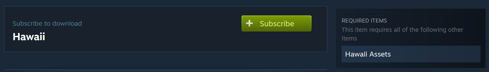

# WorkshopDownloadConfig.json
The `WorkshopDownloadConfig.json` file is used to configure the workshop download settings for your server. It allows you to specify which mods and maps should be downloaded from the Steam Workshop and installed on your server.

```json
{
  "File_IDs": [],
  "Ignore_Children_File_IDs": [],
  "Query_Cache_Max_Age_Seconds": 600,
  "Max_Query_Retries": 2,
  "Use_Cached_Downloads": true,
  "Should_Monitor_Updates": true,
  "Shutdown_Update_Detected_Timer": 600,
  "Shutdown_Update_Detected_Message": "Workshop file update detected, shutdown in: {0}",
  "Shutdown_Kick_Message": "Shutdown for Workshop file update."
}
```

## File_IDs
The `File_IDs` array contains the Steam Workshop IDs of the mods and maps that should be downloaded and installed on your server. You can find the Workshop ID in the URL of the mod or map on the Steam Workshop.

For example, if the URL of the mod is:
```
https://steamcommunity.com/sharedfiles/filedetails/?id=2876376295
```
The Workshop ID is: `2876376295` so you should add it to the `File_IDs` like this:
```json
"File_IDs": [
    2876376295
],
```

## Ignore_Children_File_IDs
The `Ignore_Children_File_IDs` array contains the Steam Workshop IDs of the mods that should not be downloaded, even if they are dependencies of the mods specified in the `File_IDs` array.



For example [Hawaii](https://steamcommunity.com/sharedfiles/filedetails/?id=1753134636) map has [Hawaii Assets](https://steamcommunity.com/workshop/filedetails/?id=1753131903) in required items. If you want to download only Hawaii map, you should add Hawaii map ID to `File_IDs` and Hawaii Assets ID to `Ignore_Children_File_IDs`.

```json
"File_IDs": [
    1753134636 // Hawaii map
],
"Ignore_Children_File_IDs": [
    1753131903 // Hawaii Assets
],
```

## Query_Cache_Max_Age_Seconds
The `Query_Cache_Max_Age_Seconds` specifies how long the server should cache the workshop query results before refreshing them. The default value is `600` seconds (10 minutes).  

If you have a mod that was recently updated and you want to force the server to check for updates, you can set this value to `0`.

## Max_Query_Retries
The `Max_Query_Retries` specifies how many times the server should retry downloading a mod if the download fails. The default value is `2`. 

I don't think you should change this value.

## Use_Cached_Downloads
The `Use_Cached_Downloads` specifies whether the server should use the cached downloads or download the mods again everytime the server starts.

If you have lots of mods on the server and you disable this option, the server will take longer to start after each restart.

## Should_Monitor_Updates
The `Should_Monitor_Updates` specifies whether the server should monitor the workshop files for updates. If an update is detected, the server will display a message and shutdown after the specified time.

This works very similar to the `Enable_Update_Shutdown` option in `Config.json`. It will warn the players that the server will shutdown for an update of mod and then shutdown after the specified time.

## Shutdown_Update_Detected_Timer
The `Shutdown_Update_Detected_Timer` specifies how long the server should wait before shutting down after an update is detected. The default value is `600` seconds (10 minutes).

## Shutdown_Update_Detected_Message
The `Shutdown_Update_Detected_Message` specifies the message that will be displayed to the players when an update is detected.

## Shutdown_Kick_Message
The `Shutdown_Kick_Message` specifies the message that will be displayed to the players when they are kicked from the server due to an update.